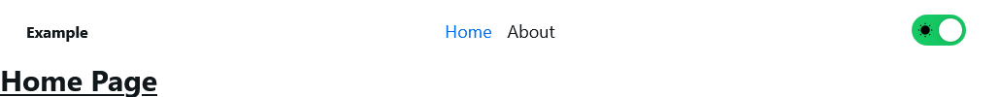

# TAVERN-Stack

TAVERN Stack - [Typescript](https://www.typescriptlang.org/) + [Vite](https://vitejs.dev/) + [React](https://react.dev/) + [NextUI](https://nextui.org/)

## Getting Started

To get started with TAVERN Stack, you can use the following commands   
Install TAVERN Stack globally

```bash
npm install tavern-stack -g
```

Create a new project

```bash
tavern create my-app
# Then fill out the prompts
```

Once the project is created, you can navigate to the project directory and run the following commands

```bash
cd my-app
npm install
npm run dev
```

This will start the development server and you can view the project at [http://localhost:5173](http://localhost:5173) which should look something like this

